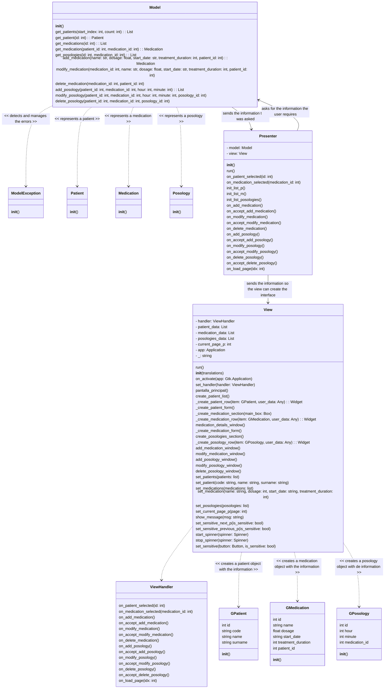
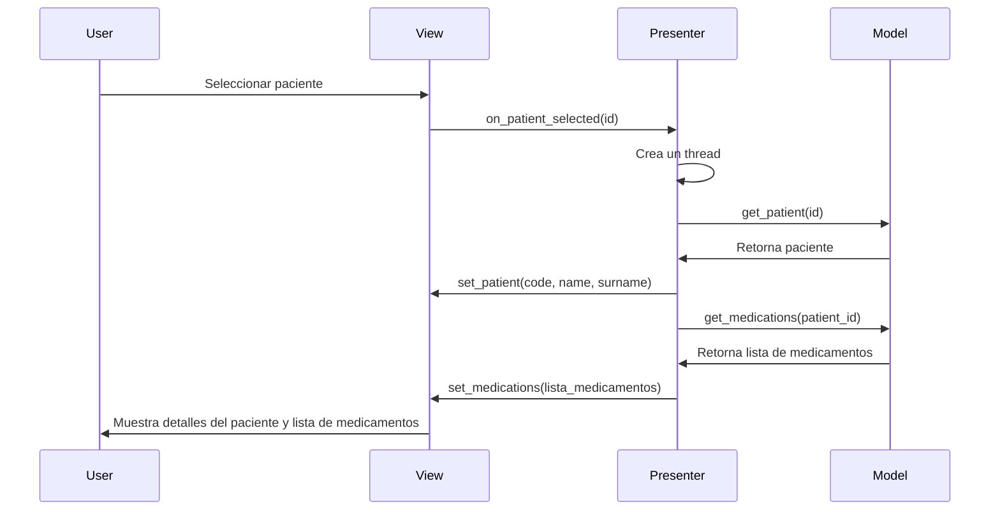
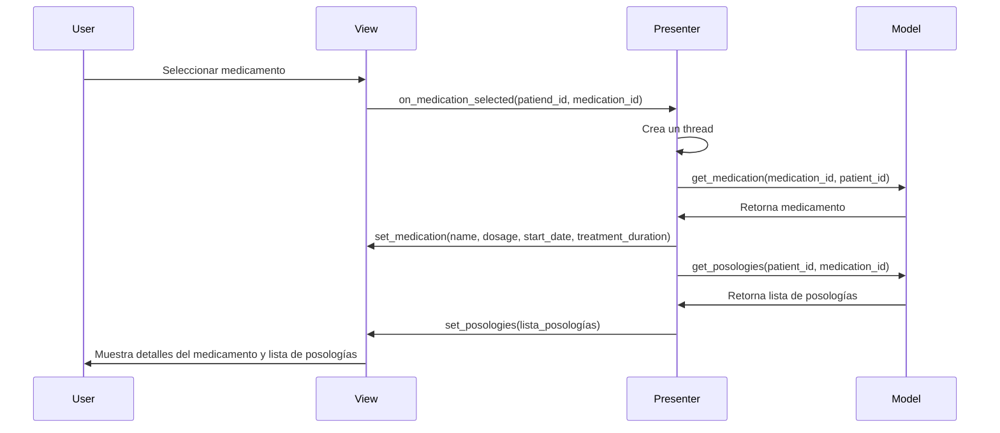
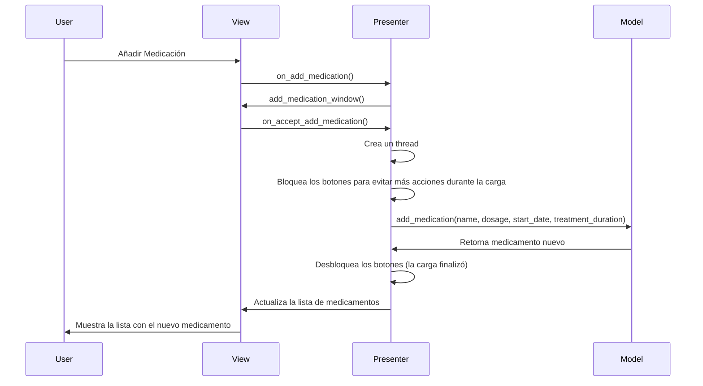
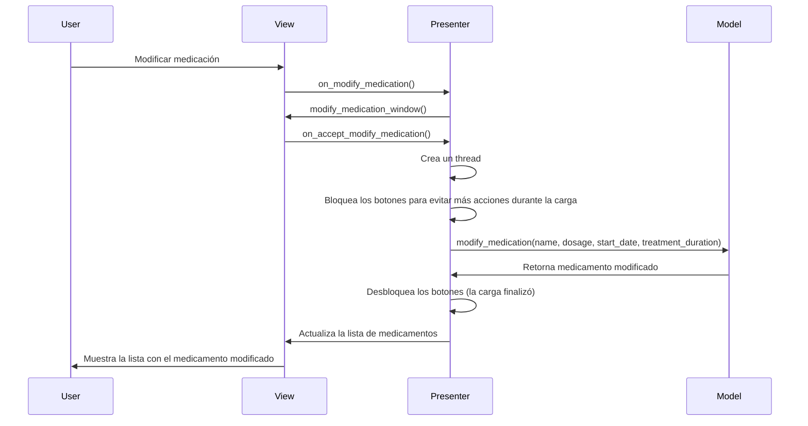
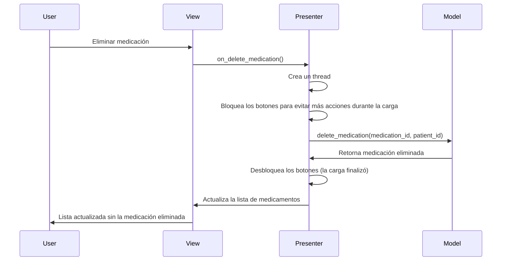
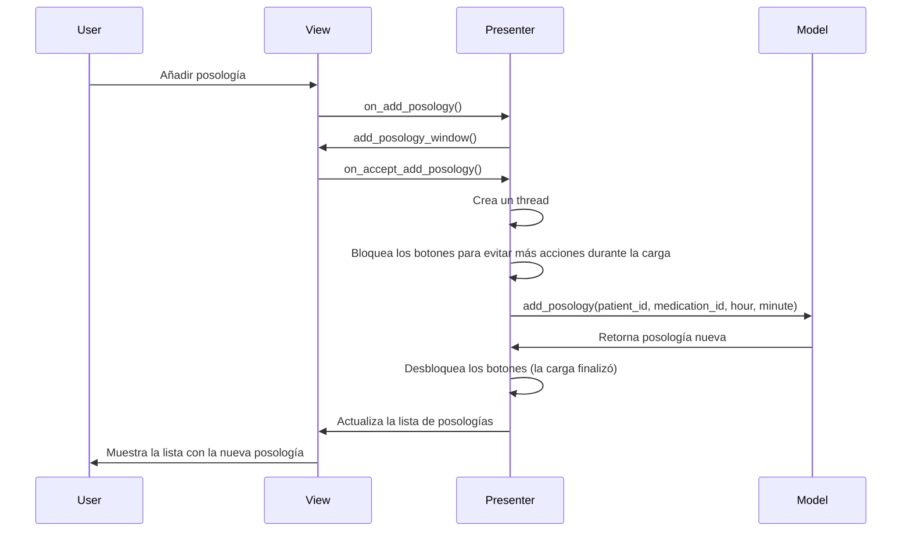
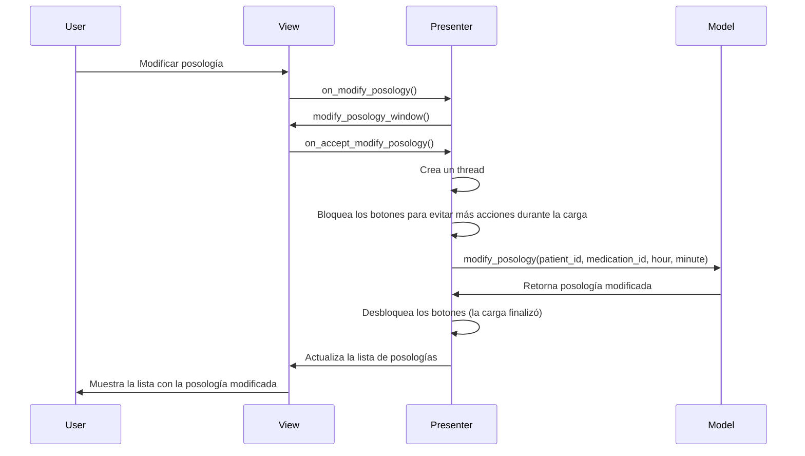
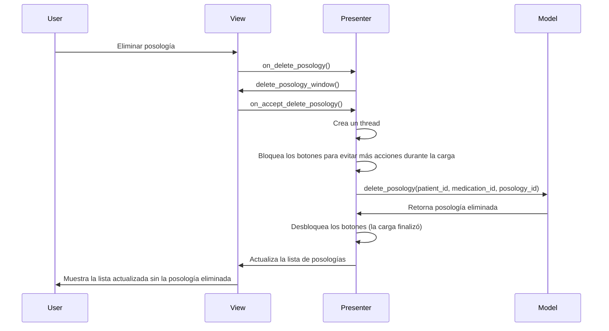

# Diseño Software
Usamos un modelo MCV (Model Controller View). El sistema está separado en 3 partes:
- **El controller:** es el cerebro del programa, vincula el resto de partes y las organiza.
- **El modelo:** actúa como recaudador de información.
- **El view:** se encarga de crear los objetos e interfaces que se le mostrarán al usuario.

### Diagrama estático:

### Diagramas dinámicos:
**Seleccionar un paciente:**

**Seleccionar un medicamento:**

**Añadir medicamentos:**

**Modificar un medicamento:**

**Eliminar un medicamento:**

**Añadir una posología:**

**Modificar posologia:**

**Eliminar una posologia:**

